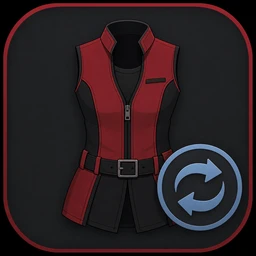
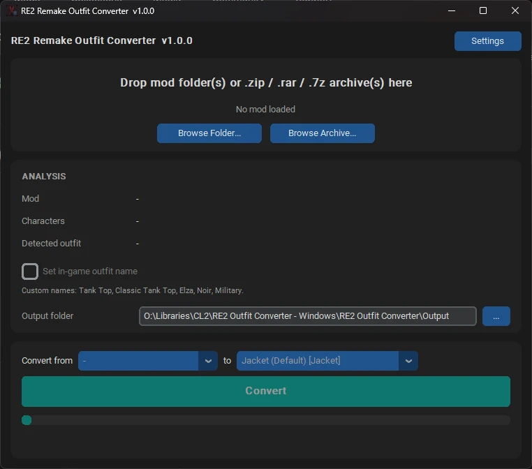
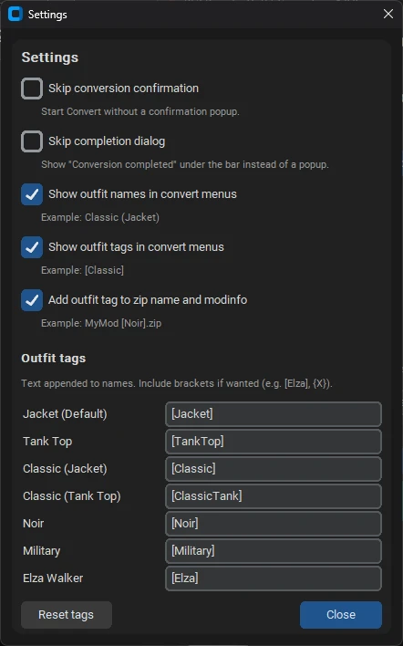

# RE2 Remake Outfit Converter

**Version 1.1.8**

A GUI tool (Windows exe + Linux package) that converts Resident Evil 2 Remake
(Fluffy Mod Manager) Claire costume mods from one outfit slot to another —
e.g. take a mod made for Elza Walker and re-target it to Noir or Jacket.

## Screenshots

<p align="center">
  
</p>

**Main window**



**Settings**



## Quick start (release builds)

**Windows** — extract `RE2.Outfit.Converter.v1.1.8.Windows.zip`, run
`RE2 Outfit Converter.exe` from the extracted folder (keep `_internal` next
to the exe).

**Linux** — extract `RE2.Outfit.Converter.v1.1.8.Linux.zip`, run `./run.sh`
(opens the same GUI; needs Python 3.10+, `python3-tk`, and a desktop session —
see that package’s `README.txt`). Pack from source with `pack-linux.bat`.

GUI steps (Windows / Linux):
1. Drop a mod folder or `.zip` / `.rar` / `.7z` onto the window
   (Windows: `.rar` / `.7z` need [7-Zip](https://www.7-zip.org/);
   Linux: install `p7zip` so `7z` is on `PATH`).
2. Confirm source / target outfits, set an output folder, click **Convert**.
3. Drop the resulting `.zip` into Fluffy’s `Games\RE2R\Mods` folder
   **without extracting**.

Multi-select a main mod plus its AddonFor options to get one multi-mod `.zip`.

## Costume names

The header **Costume names** button opens a small editor that builds a Fluffy
**name pack** (not a body convert). Use it when you want custom costume-menu
labels for the outfits that share one game MSG file.

**Claire tab**

| Slot |
|------|
| Jacket |
| Tank Top |
| Classic Jacket |
| Classic Tank Top |

**Leon tab**

| Slot |
|------|
| Casual |
| Police |
| Police (Injured) |
| Classic Police |
| Classic Police (Injured) |

How it works:
1. Click **Costume names** → choose **Claire** or **Leon**.
2. Type new names (leave a box blank to keep vanilla).
3. Click **Create** → a zip like `Costume Name Pack.zip` is written to your
   output folder (`modinfo.ini` + the shared `mes_sys_costume` /
   `mes_sys_reward` files).
4. Drop that zip into Fluffy **without extracting**, and enable it.

Notes:
- Claire and Leon edits in one Create go into **one** pack so they do not
  overwrite each other.
- Enable only **one** costume name pack at a time in Fluffy (last enabled
  mod wins for those shared files).
- Convert-time **Set in-game outfit name** is only for **Elza / Noir /
  Military** (each has its own MSG file). Jacket / Tank / Classic* (and
  Leon’s slots above) use **Costume names** instead.

## Layout

This folder (`Source/`) is the git repository root. Sibling folders next to it:

| Folder | Purpose |
|--------|---------|
| `Source/` | Application source, tests, docs, pack scripts (this tree) |
| `Build/` | Local Windows GUI build + shortcuts (day-to-day testing) |
| `Production/` | Final Windows/Linux release copies from pack scripts |

Shortcuts live in `Build/`. Run `rebuild.bat` from here to refresh the test app.

## Run from source

From this `Source/` folder:

```
pip install -r requirements.txt
python main.py
```

Requires Python 3.10+.

**Linux GUI from source / release tree:** `pip install -r requirements-linux.txt`
then `python main.py` (system Tkinter required).

See also:

- [CHANGELOG.md](CHANGELOG.md) — release notes
- [USER GUIDE.txt](USER%20GUIDE.txt) — end-user guide (ships with Windows zip)
- [docs/PIPELINE.md](docs/PIPELINE.md) — conversion stage order
- [docs/BINARY_PATCHING.md](docs/BINARY_PATCHING.md) — path overlay limits
- [docs/REVIEW_NOTES.md](docs/REVIEW_NOTES.md) — short review checklist

## Supported outfits (Claire)

| Outfit            | PFB slot(s)              | Body mesh ID |
|-------------------|--------------------------|--------------|
| Jacket (Default)  | default, costume_1/2     | pl1000       |
| Tank Top          | costume_3/4              | pl1001       |
| Classic (Jacket)  | costume_5/6/7            | pl1002       |
| Classic (Tank Top)| costume_8/9              | pl1003       |
| Noir              | costume_a                | pl1005       |
| Military          | costume_b                | pl1006       |
| Elza Walker       | costume_c                | pl1004       |
| '98 Classic       | costume_d                | pl1007       |

Convert menus follow that order (Jacket → Elza). `'98 Classic` is
detect-only and omitted from convert menus — its mesh layout differs from
the other Claire outfits.

For costume-menu renaming (Claire Jacket/Tank/Classic* and Leon
Casual/Police/Classic*), see [Costume names](#costume-names).

## What conversion does

- Renames Claire body PFB slots and mesh folders to the target outfit.
- Isolates shared face / hair meshes onto private IDs so Fluffy mods stop
  fighting over `pl1050` / `pl1070`.
- Isolates common shared outfit texture folders (`Pl2020`,
  `Escape/Character/Textures`) used by many CR-AW packs.
- Injects a hair redirect when converting into Noir / Military so
  vanilla hats do not reappear in gameplay, and seeds `pl1075` /
  `pl1071` with Claire hair meshes so the costume-select 3D preview
  matches (hat/headband hidden).
- Converting **to Military** auto-seeds Claire’s clean face when the mod
  has no face data; Tank Top strips leftover Military dirty face textures.
- Strips author figure-gallery scenes so Records viewers do not bleed
  across DLC outfit slots (vanilla gallery + remapped body mesh).
- Patches same-length path strings inside engine binaries.
- Optionally sets DLC in-game costume names (Elza / Noir / Military).

The original mod is never modified.

Fluffy may still warn about **Ada** packs, weapon motion banks, or shared VFX
files — those are outside Claire outfit isolation.

## Tests

From this `Source/` folder:

```
pip install -r requirements.txt
pytest
```

## Build the Windows app

### Local / folder build (test copy)

From this `Source/` folder, run `rebuild.bat` (or the Rebuild shortcut in
`../Build/`). That installs dependencies, builds into `../Build/dist`, and syncs
the runnable app to `../Build/RE2 Outfit Converter/`.

Manual equivalent:

```
pip install -r requirements.txt pyinstaller
python -m PyInstaller --noconfirm --workpath ../Build/pyi-work --distpath ../Build/dist "RE2 Outfit Converter.spec"
```

Then sync `../Build/dist/RE2 Outfit Converter/` to `../Build/RE2 Outfit Converter/`.

On Windows, avoid letting PyInstaller use a default `build\` work folder named
the same as `Build\` (case-insensitive collision).

### Production package

```
pack-windows.bat
```

Writes under `../Production/` and a Nexus zip
`RE2.Outfit.Converter.v1.1.8.Windows.zip` (folder build: exe + `_internal`).

## Build the Linux package

From this `Source/` folder on Windows, run `pack-linux.bat`. That stages the GUI
scripts, `main.py`, `requirements-linux.txt`, and `re2_outfit_converter/`, then
writes the Linux zip under `../Production/`.

On Linux: extract, `chmod +x run.sh`, `./run.sh`.
