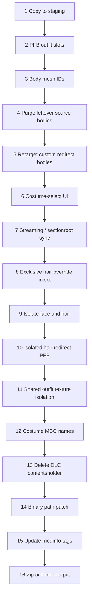

# Conversion pipeline

`converter.convert` stages a full copy of the mod, then runs focused helpers.
Order matters: later steps (especially binary path patching) depend on
`rename_map` entries built by earlier renames and isolation.

## Stage flow

## Stage list (mirrors `converter.convert`)

| # | Notify / step | Module | Notes |
|---|---------------|--------|-------|
| 1 | Copy to staging | `shutil.copytree` | Original mod never modified |
| 2 | PFB outfit slots | `prefabs` | Copy primary source PFB onto all target slots |
| 3 | Body mesh IDs | `meshes.convert_mesh_ids` | Body only; face/hair later |
| 4 | Purge leftovers | `meshes.purge_source_body_meshes` | When rename skipped (collision) |
| 5 | Redirect bodies | `meshes.retarget_redirect_bodies` | Nurse / Ghost Witch `pl1008` → target body |
| 6 | Costume UI | `costume_ui` | Remap `ui0601_01_XX`, or stash for Classic |
| 7 | Streaming sync | `meshes.sync_streaming_meshes` | Mirror sectionroot ↔ streaming |
| 8 | Exclusive hair | `hair_prefabs.ensure_exclusive_hair_override` | Noir/Military hat hide |
| 9 | Face/hair isolation | `isolation.isolate_claire_face_hair` | Private `pl18xx` + `rename_map` |
| 10 | Isolated hair PFB | `hair_prefabs.ensure_isolated_hair_redirect` | Inject + alias for patch |
| 11 | Shared textures | `isolation.isolate_shared_outfit_textures` | CR-AW `Pl2020` / `Textures` |
| 12 | Costume MSG | `msg_name.sync_costume_name_files` | DLC clairecos or shared sys MSG |
| 13 | Contentsholder | `contentsholder` | Delete only — never retarget |
| 14 | Binary patch | `path_patch` | Same-length ASCII + UTF-16LE |
| 15 | Modinfo | `packaging.update_modinfo` | Tag + screenshot casing |
| 16 | Package | `packaging.make_zip` / `make_folder` | Fluffy-ready output |

Batch mode wraps each item in `convert(..., as_folder=True)` (or
`batch.passthrough_folder` on `NothingToConvertError`), then zips the staging root.

## Interaction notes

### `rename_map` → binary patch

Filesystem renames register engine-relative paths in `rename_map`. Only pairs
with **equal string length** are applied inside binaries. Hair redirect PFBs
and isolation aliases must be registered **before** stage 14.

### Hair inject → isolation → aliases → patch

1. Exclusive override may inject a pl1070 hair redirect into Noir/Military slots.
2. Isolation moves shared/exclusive hair meshes onto `pl18xx`.
3. Isolated hair redirect injects (if needed) and adds `pl1070` → private aliases.
4. `patch_binaries` rewrites those aliases inside the injected PFB and other files.

### Classic UI stash

For Classic targets, live `ui0601` previews are moved under `_re2oc_ui_stash`
(game ignores them). Converting **from** Classic restores the stash first, then
remaps IDs onto a supported target.

### Streaming before isolation

Stage 7 mirrors mesh folders so both sectionroot and streaming trees exist
before isolation renames IDs. Isolating first would leave one tree on shared IDs.

### Contentsholder

DLC `contentsholder_dlc*` scenes cannot be safely retargeted (register hashes).
They are deleted; loose PFBs/UI/MSG are enough for the target slot.

### AddonFor / private IDs

`isolation.isolation_seed` uses `AddonFor` / `NameAsBundle` / `Name` so face/hair
addons share the main mod’s `pl18xx` IDs. Batch/session linking fills missing
`AddonFor` for orphan Claire packs.
