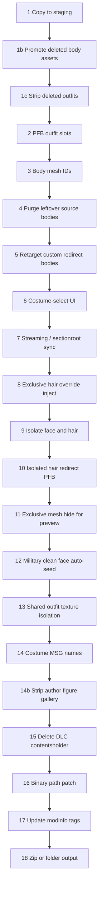

# Conversion pipeline

`converter.convert` / `convert_with_ops` stages a full copy of the mod, then
runs focused helpers. Multi-outfit packs use a list of `OutfitOp` (convert
source→target, or delete with `target=None`). Delete strips PFB / body mesh /
UI / DLC MSG for that slot before convert ops run.

Order matters: later steps (especially binary path patching) depend on
`rename_map` entries built by earlier renames and isolation.

## Stage flow

```mermaid
flowchart TD
  copy[1 Copy to staging]
  promote[1b Promote deleted body assets]
  strip[1c Strip deleted outfits]
  pfb[2 PFB outfit slots]
  mesh[3 Body mesh IDs]
  purge[4 Purge leftover source bodies]
  redirect[5 Retarget custom redirect bodies]
  ui[6 Costume-select UI]
  stream[7 Streaming / sectionroot sync]
  hairEx[8 Exclusive hair override inject]
  iso[9 Isolate face and hair]
  hairIso[10 Isolated hair redirect PFB]
  exclMesh[11 Exclusive mesh hide for preview]
  milFace[12 Military clean face auto-seed]
  tex[13 Shared outfit texture isolation]
  msg[14 Costume MSG names]
  figStrip[14b Strip author figure gallery]
  holder[15 Delete DLC contentsholder]
  patch[16 Binary path patch]
  modinfo[17 Update modinfo tags]
  pack[18 Zip or folder output]
  copy --> promote --> strip --> pfb --> mesh --> purge --> redirect --> ui --> stream
  stream --> hairEx --> iso --> hairIso --> exclMesh --> milFace --> tex --> msg --> figStrip
  figStrip --> holder --> patch --> modinfo --> pack
```

## Stage list (mirrors `converter.convert_with_ops`)

| # | Notify / step | Module | Notes |
|---|---------------|--------|-------|
| 1 | Copy to staging | `shutil.copytree` | Original mod never modified |
| 1b | Promote deleted bodies | `promote_body.promote_deleted_body_assets` | Before strip when convert+delete; textures on deleted sibling ride into convert source |
| 1c | Strip deletes | `strip_outfit.strip_outfit_slot` | PFB / body / exclusive hair / UI / DLC MSG |
| 2 | PFB outfit slots | `prefabs` | Per convert op |
| 3 | Body mesh IDs | `meshes.convert_mesh_ids` | Body only; face/hair later |
| 4 | Purge leftovers | `meshes.purge_source_body_meshes` | When rename skipped (collision) |
| 5 | Redirect bodies | `meshes.retarget_redirect_bodies` | Nurse / Ghost Witch `pl1008` → target body |
| 6 | Costume UI | `costume_ui` | Remap `ui0601_01_XX` (incoming art wins on collision), or stash for Classic |
| 7 | Streaming sync | `meshes.sync_streaming_meshes` | Mirror sectionroot ↔ streaming |
| 8 | Exclusive hair | `hair_prefabs.ensure_exclusive_hair_override` | Noir/Military hair PFB redirect |
| 9 | Face/hair isolation | `isolation.isolate_claire_face_hair` | Private `pl18xx` + `rename_map` |
| 10 | Isolated hair PFB | `hair_prefabs.ensure_isolated_hair_redirect` | Inject + alias for patch |
| 11 | Exclusive mesh hide | `exclusive_meshes.ensure_exclusive_part_mesh_hide` | Seed `pl1075`/`pl1071` for costume preview |
| 12 | Face clean / strip | `military_face.ensure_military_clean_face` | Tank Top: strip Military `*_04` face folders **before** isolation. Military: auto-seed Claire default `pl1050_04` when staging has no face data |
| 13 | Shared textures | `isolation.isolate_shared_outfit_textures` | CR-AW `Pl2020` / `Textures` |
| 14 | Costume MSG | `msg_name.sync_costume_names_for_targets` | All convert targets in one pass (keeps sibling clairecos files) |
| 14b | Figure gallery | `figure_scenes.strip_claire_extra_figures` | Strip author `figurescene` / `figure` ids 10–13 (convert + delete-only) |
| 15 | Contentsholder | `contentsholder` | Delete only — never retarget |
| 16 | Binary patch | `path_patch` | Same-length ASCII + UTF-16LE (paths + `*_Mat` names) |
| 16b | Material hashes | `material_hash.patch_mdf_material_hashes` | Murmur3 hashes must match remapped `*_Mat` (rain/wet + body bind) |
| 17 | Modinfo | `packaging.update_modinfo` | Tag + screenshot casing |
| 18 | Package | `packaging.make_zip` / `make_folder` | Fluffy-ready output |

Batch mode wraps each item in `convert_with_ops(..., as_folder=True)` (or
`batch.passthrough_folder` on `NothingToConvertError`), then zips the staging root.

Incomplete slots (textures/mdf without `.mesh`) are detected by
`outfit_health.incomplete_outfits` for GUI warnings.
Load-set merge (`incomplete_outfits_for_load`) suppresses addon-only
texture-without-mesh flags when a main package (no AddonFor) already
supplies that outfit’s body mesh.

## Interaction notes

### `rename_map` → binary patch

Filesystem renames register engine-relative paths in `rename_map`. Only pairs
with **equal string length** are applied inside binaries. Hair redirect PFBs
and isolation aliases must be registered **before** stage 16.

### Hair inject → isolation → exclusive mesh → Military face → aliases → patch

1. Exclusive override may inject a pl1070 hair redirect into Noir/Military slots
   (skipped when the source already ships an exclusive hat kit).
2. Isolation always moves shared face/hair onto `pl18xx`. Exclusive
   `pl1071`/`pl1075` are kept when converting *into* that same slot; when
   converting *away*, they move to `pl18xx` (no loose exclusive files left, so
   Military/Noir stay vanilla). Mesh material names stay on the exclusive ID;
   a bundled private `.mdf2` is seeded so custom scarf/hat textures bind.
3. Isolated hair redirect: private mesh+mdf when a private mdf exists; else
   private mesh + vanilla exclusive `.mdf2`; otherwise private/`pl1070` aliases.
4. Exclusive mesh hide copies Claire hair (isolated, mod `pl1070`, or bundled
   template) onto `pl1075` / `pl1071` so the costume-select 3D preview does not
   show the vanilla hat/headband (gameplay already uses the hair PFB redirect).
5. Face clean / strip: Tank Top strips leftover Military `*_04` face folders
   before isolation (Claire default face). Military seeds Claire default
   `pl1050_04` only when staging has no face PFBs / `*_04` textures. Mods with
   their own face are
   left alone.
6. `patch_binaries` rewrites path/`*_Mat` aliases; `patch_mdf_material_hashes`
   updates Murmur3 hashes so body + rain/wet still bind after a body-ID retarget.

### Classic UI stash

For Classic targets, live `ui0601` previews are moved under `_re2oc_ui_stash`
(game ignores them). Converting **from** Classic restores the stash first, then
remaps IDs onto a supported target.

### Streaming before isolation

Stage 7 mirrors mesh folders so both sectionroot and streaming trees exist
before isolation renames IDs. Isolating first would leave one tree on shared IDs.

### Contentsholder

DLC `contentsholder_dlc*` scenes cannot be safely retargeted (register hashes).
They are deleted; loose PFBs/UI/MSG are enough for the target slot.

### AddonFor / private IDs

`isolation.isolation_seed` uses `AddonFor` / `NameAsBundle` / `Name` so face/hair
addons share the main mod’s `pl18xx` IDs. Batch/session linking fills missing
`AddonFor` for orphan Claire packs.
